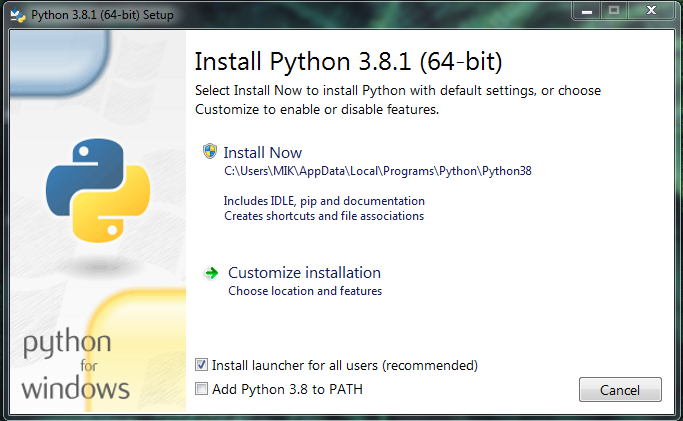
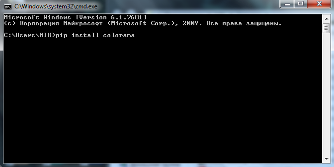
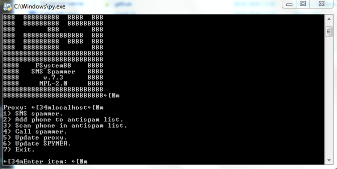

# Как установить?
<b>Тупо следуйте инструкции...</b><br>
<b>Если у вас Android/<b> - скачать <a href="https://play.google.com/store/apps/details?id=com.termux&hl=ru">Termux из Google Play</a>, открыть его и прописать команды ниже:<br>
• <code>apt update</code><br>
• <code>apt upgrade</code><br>
• <code>apt install git</code><br>
• <code>git clone https://github.com/FSystem88/spymer</code><br>
• <code>sh ~/spymer/install.sh</code><br>
• <code>spymer</code><br>

<b>Если у вас iOS</a> - скачать <a href="https://apps.apple.com/ru/app/testflight/id899247664">Testflight из App Store</a>, после чего присоедениться к тестированию <a href="https://testflight.apple.com/join/97i7KM8O">iSH в Testflight</a> и прописать команды ниже:<br>
• <code>apk update</code><br>
• <code>apk upgrade</code><br>
• <code>apk add git</code><br>
• <code>git clone https://github.com/FSystem88/spymer</code><br>
• <code>sh ~/spymer/install.sh</code><br>
• <code>spymer</code><br>
<br>
Установка на Linux аналогична установке на Android, только без Termux'a, достаточно прав SU и терминала.<br>

# For Windows (NEW)

Теперь ничего не нужно устанавливать, просто качаете [архив](https://github.com/FSystem88/spymer/archive/master.zip) с репозиторием, распаковываете его, и запускаете spammer.exe

# For Windows (OLD)

Если же у вас не рабоатет первый способ, или вам просто нечем заняться, то можно запустить spymer из исходников:

1) Скачиваем Python с [официального](https://www.python.org/downloads/) сайта и производим его установку.

2) При установке ОБЯЗАТЕЛЬНО ставим галочку на графе PATH чтобы иметь доступ к Python из CMD:



3) Далее находим в поиске Windows программу cmd, открываем, и прописываем команду:
```
pip install colorama
```


4) Ждем окончания установки, и скачиваем [архив](https://github.com/FSystem88/spymer/archive/master.zip) со spymer.

5) Распаковываем в любое удобное место, и запускаем spammer.py двойным щелчком мыши.

6) PROFIT!<br>


# LICENSE
Лицензия: MPL-2.0<br>
Глаголит она о том, что если у вас будут хоть какие то проблемы с законом, то <b>эти проблемы остаются вашими</b>, ибо я всего лишь программист, а вы использовали мою программу в своих корыстных целях!
